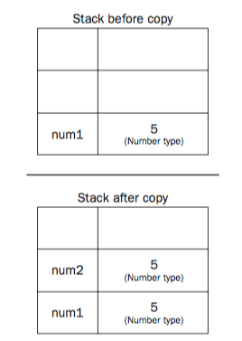
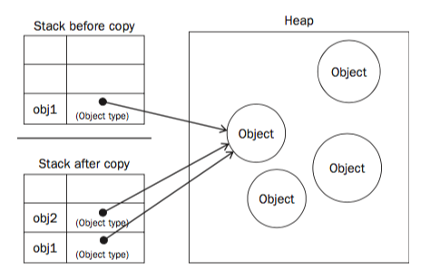

# Variables
####(See Chapter 4, Professional Javascript for Web Developers by Nicholas Zakas)

<br/>

### Primitive and Reference Values

JS variables can ___contain___ 2 type of data: __Primitive__ and __Reference__.

__Primitive__: These are atomic pieces of data. Integers, String, Boolean, Null and Undefined are Primitive values.

__Reference__: These maybe made up of multiple values. Objects are reference values.

Primitive type variables are said to be accessed by their values. Whereas while manipulating objects we work with the references to these objects rather than the actual object itself.

### Copying Values

Copying Primitive Values | Copying reference Values
                      ---|---
 | 


When a primitive value is copied from one variable to another, it gets copied to the location of the new variable.

```javascript
var num1 = 5;
var num2 = num1;
```

When a reference value of one variable is assigned to a new variable, its value also gets copied, but since it's a reference variable, what gets copied is the pointer to the object stored in the heap. So as in the following example, if we change the property `name` assigned to `obj2`, `obj1.name` also changes because we're manipulating essentially the same object. 

```javascript
var obj1 = new Object();
obj1.name = "fus";
obj2 = obj1;
obj2.name = "ro";
console.log(obj1.name); // "ro"
```

### Argument Passing

In Functions, arguments are __passed by value__.

The variable that gets passed as argument in the function, if it contains a primitive value, then that gets copied to a local variable inside the function. If it contains a reference value, then that also gets copied to a local variable inside the function.

But in case of the variable with reference value, changes made inside the function to the local variable, will reflect on the variable that was passed.

But that doesn't mean the argument was passed by reference. See this example:

```javascript
function setName(obj){
  obj.name = "fus";
  obj = new Object();
  obj.name = "ro";
}

var driver = new Object();
setName(driver);
console.log(driver.name); // "fus"
```

If the argument was passed by reference, it should have printed out "ro";

### Determining Type

Use `typeof` for variables with primitive values
Use `instaceof` for variables with reference values

```javascript
console.log(driver instanceof Object);
console.log(arr instanceof Array);
console.log(pattern instanceof RegExp);
```


